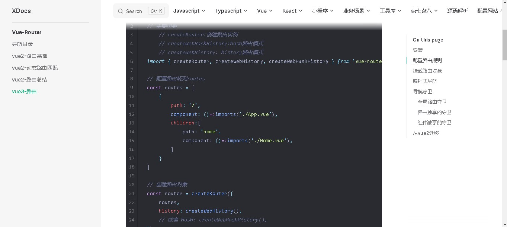
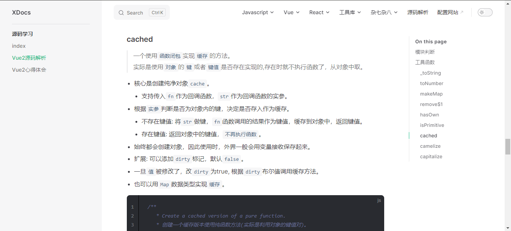
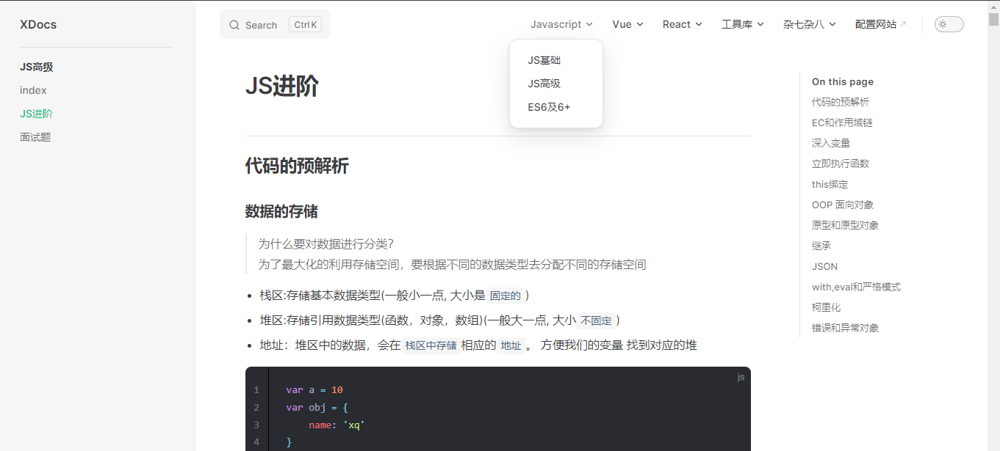

## 一些日志
- 博客模板: vitepress  
- vitepress [官方网址:](https://vitepress.dev/reference/)
- 同步在github: [xdocs:](https://github.com/xiao-shenghui/xdocs.git)
- 项目部署在github静态托管：[线上预览:](https://xiao-shenghui.github.io/xdocs.github.io/)
- 博客搭建工具: npm, cnpm, markdown
- vitepress优势: 
  - vite工具搭建,
  - 热更新快, 
  - 搭建简单,
  - 自带代码高亮, 
  - 日夜模式, 
  - 侧边栏, 
  - 主题配置.

## 博客启动
> npm run docs:dev
## 博客目录
- docs 项目目录
  - .vitepress 配置文件
  - index.md 首页

## 最新日志和效果图
- 添加`vitest`学习文档。

- 更新`vue-router 4.x`学习文档，更新`vue3-setup语法糖`和`vue3-全局API`文档

- 业务场景中，添加`骨架屏`学习文档

- 新增`vue3 API-系列`文档

- 新增小程序目录页，更新`原生小程序`文档

- 将typescript挪到导航栏，新增`js-to-ts`文档

- 源码模块中，添加`js经典设计模式`

- 添加`vue2从0-1`文档

- 更新`vue3基础-生命周期`

- 新增`完整文件上传案例-formData`文档，
- 带图片预览，进度预览，取消请求，多选上传，拖拽上传。
- 带koa定义接口，保存文件，静态托管的详细过程。

- 新增`pina`文档

- 添加`业务场景`板块，记录一下常见的业务常见(如:文件上传)。

- 丰富`vue2源码`，带板块和表格统计。

- 新增`源码解析`文档，主要记录自己学习源码的经历

- 新增`ajax`文档

- 新增`vue2笔记总结`文档

- 新增`npm包推荐`文档

- 新增`vue3`文档, 设置`深层次目录`大纲

- 新增`响应式瀑布流布局`文档

- 新增koa文档

- 打包上线展示

- Nodejs

- ES6和Promise

- 丰富javascript文档

- 首页2.0

- 丰富的前端知识

- 夜间模式

- 首页1.0

- 侧边栏和导航栏
