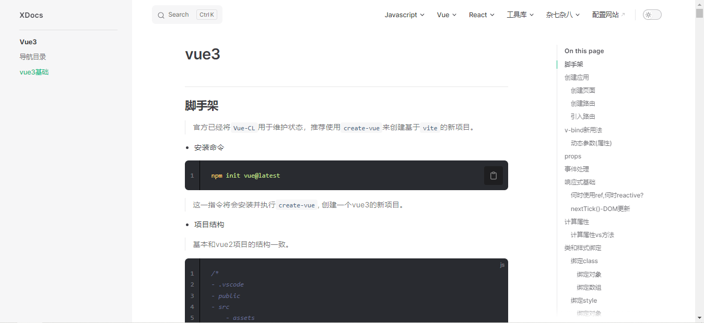
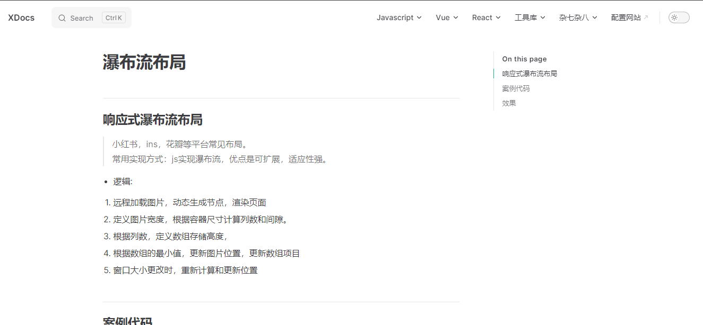
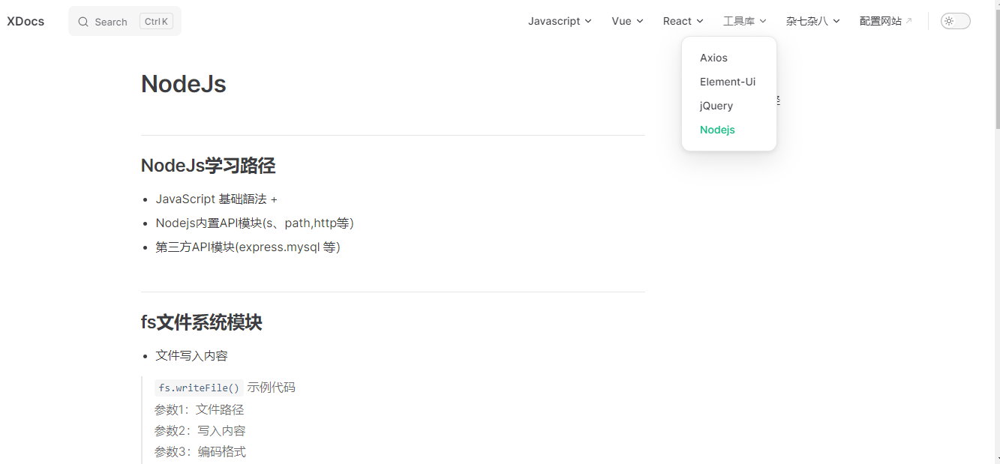
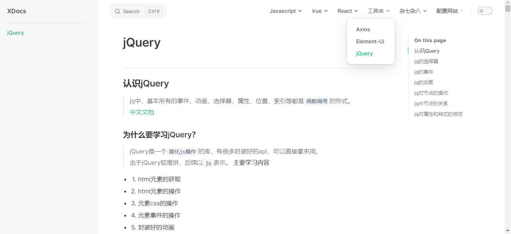
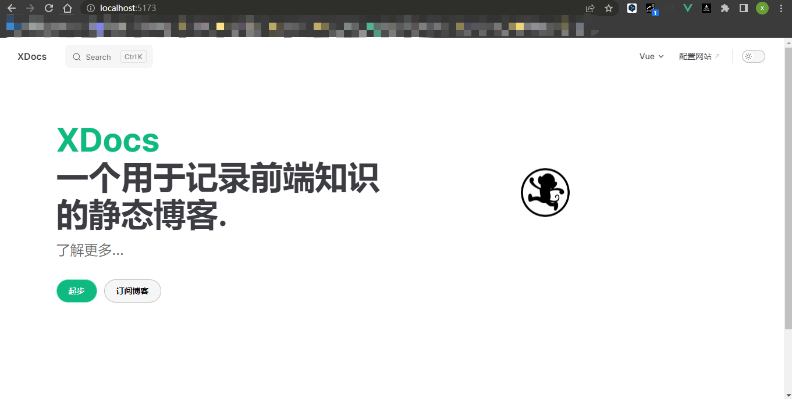

## 一些日志
- 博客模板: vitepress  
- vitepress [官方网址]: (https://vitepress.dev/reference/)
- 博客搭建工具: npm, cnpm, markdown
- vitepress优势: 
  - vite工具搭建,
  - 热更新快, 
  - 搭建简单,
  - 自带代码高亮, 
  - 日夜模式, 
  - 侧边栏, 
  - 主题配置.

## 博客启动
> npm run docs:dev
## 博客目录
- docs 项目目录
  - .vitepress 配置文件
  - index.md 首页

## 最新效果图
- 新增`vue3`文档, 设置`深层次目录`大纲

- 新增`响应式瀑布流布局`文档

- 新增koa文档

- 打包上线展示

- Nodejs

- ES6和Promise

- 丰富javascript文档

- 首页2.0

- 丰富的前端知识

- 夜间模式

- 首页1.0

- 侧边栏和导航栏
