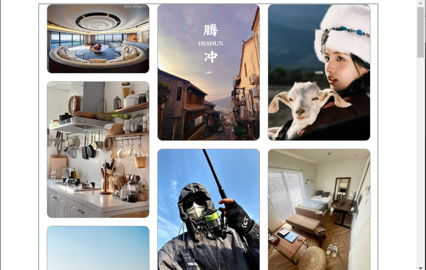
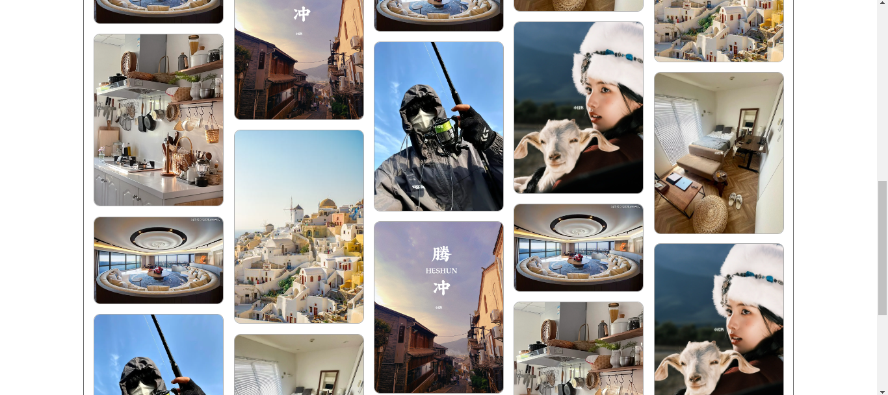

# 瀑布流布局
## 响应式瀑布流布局
> 小红书，ins，花瓣等平台常见布局。  
> 常用实现方式：js实现瀑布流，优点是可扩展，适应性强。  
- 逻辑: 
1. 远程加载图片，动态生成节点，渲染页面
2. 定义图片宽度，根据容器尺寸计算列数和间隙。
3. 根据列数，定义数组存储高度，
4. 根据数组的最小值，更新图片位置，更新数组项目
5. 窗口大小更改时，重新计算和更新位置
## 案例代码
- html
```html
<style>
    * {
        margin: 0;
        padding: 0;
        box-sizing: border-box;
    }

    body {
        position: relative;
    }

    .container {
        margin: 0 auto;
        border: 3px solid rgb(173, 173, 173);
        position: relative;
    }
</style>
<div class="container">
</div>
```
- js
```js
// fetch获取数据
let container = document.querySelector('.container');
let data, col, spacing;
let imgW = 200; //自定义每张图片的宽度

// 远程获取数据和主要程序
async function mian() {
    let url = 'https://www.fastmock.site/mock/9ab0bb5c08b7c6f43a7c08b333c93742/redbook/list'
    let response = await fetch(url);
    data = await response.json(); //解析json 都是异步的
    data = data.concat(data, data, data); //双倍
    // 计算开列数和间隙
    caculate();
    // 渲染页面
    render();
    // 排兵布阵
    imgP();

    window.onresize = function () {
        // 页面更新尺寸时,重新计算,重新排布.
        // 计算开列数和间隙
        caculate();
        // 排兵布阵
        imgP();
    }
}
mian();


// 计算容器可容纳的列数和图片的宽高
function caculate() {
    let w = parseInt(getComputedStyle(container).width);
    col = Math.floor(w / imgW);
    spacing = (w - col * imgW) / (col + 1);
    console.log(spacing);
}

// 渲染数据,图片300宽度
function render() {
    // 根据data的长度,生成img结构
    let container = document.querySelector('.container');
    data.forEach((e, i) => {
        if (i == 0) e.img = 'https://img1.baidu.com/it/u=1242359107,1794231606&fm=253&fmt=auto&app=138&f=JPEG?w=743&h=500'
        let img = document.createElement('img');
        img.src = e.img;
        img.width = imgW + '';
        img.style.borderRadius = '10px';
        img.style.border = "1px solid rgb(173, 173, 173)";
        img.style.position = "absolute";
        container.append(img);
    });
}

// 定位图片位置
function imgP() {
    let imgs = document.querySelectorAll('img');
    let arr = new Array(col);
    arr.fill(0);
    let min, h;
    console.log(arr);
    imgs.forEach((item, index) => {
        min = Math.min(...arr);
        h = parseInt(getComputedStyle(item).height);
        item.style.left = (arr.indexOf(min) + 1) * spacing + imgW * arr.indexOf(min) + 'px';
        item.style.top = arr[arr.indexOf(min)] + 'px';
        arr[arr.indexOf(min)] = arr[arr.indexOf(min)] + h + spacing;
    });
    console.log(arr);
    // 设置父盒子高度
    let container = document.querySelector('.container');
    max = Math.max(...arr);
    container.style.height = max + 'px';
}

```
## 效果
- 小尺寸：


- 大尺寸：
